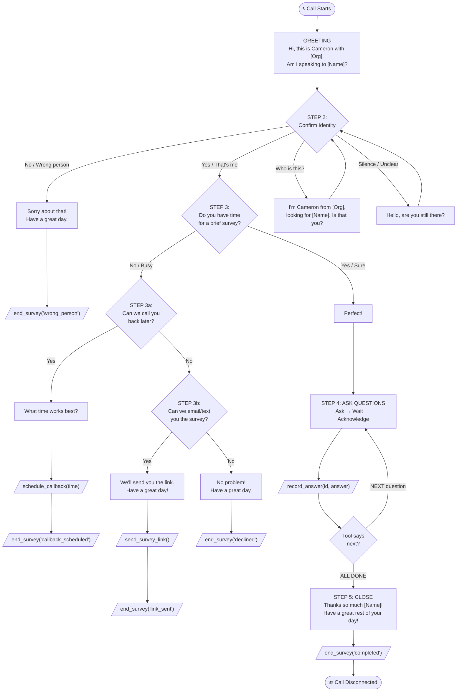

```mermaid
flowchart TD
    A([📞 Call Starts]) --> B["GREETING<br/>Hi, this is Cameron with [Org].<br/>Am I speaking to [Name]?"]
    B --> C{STEP 2:<br/>Confirm Identity}

    C -->|"Yes / That's me"| D{STEP 3:<br/>Do you have time<br/>for a brief survey?}
    C -->|"No / Wrong person"| E["Sorry about that!<br/>Have a great day."]
    E --> E1[/"end_survey('wrong_person')"/]
    C -->|"Who is this?"| F["I'm Cameron from [Org],<br/>looking for [Name]. Is that you?"]
    F --> C
    C -->|"Silence / Unclear"| G["Hello, are you still there?"]
    G --> C

    D -->|"Yes / Sure"| H["Perfect!"]
    H --> Q

    D -->|"No / Busy"| I{STEP 3a:<br/>Can we call you<br/>back later?}

    I -->|Yes| J["What time works best?"]
    J --> J1[/"schedule_callback(time)"/]
    J1 --> J2[/"end_survey('callback_scheduled')"/]

    I -->|No| K{STEP 3b:<br/>Can we email/text<br/>you the survey?}

    K -->|Yes| L["We'll send you the link.<br/>Have a great day!"]
    L --> L1[/"send_survey_link()"/]
    L1 --> L2[/"end_survey('link_sent')"/]

    K -->|No| M["No problem!<br/>Have a great day."]
    M --> M1[/"end_survey('declined')"/]

    Q["STEP 4: ASK QUESTIONS<br/>Ask → Wait → Acknowledge"] --> R[/"record_answer(id, answer)"/]
    R --> S{Tool says<br/>next?}
    S -->|"NEXT question"| Q
    S -->|"ALL DONE"| T

    T["STEP 5: CLOSE<br/>Thanks so much [Name]!<br/>Have a great rest of your day!"]
    T --> U[/"end_survey('completed')"/]
    U --> V([🔚 Call Disconnected])
```
