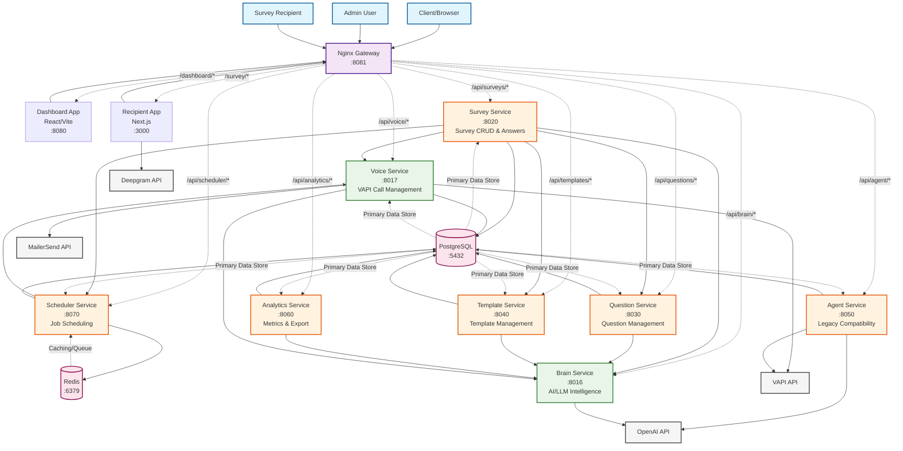
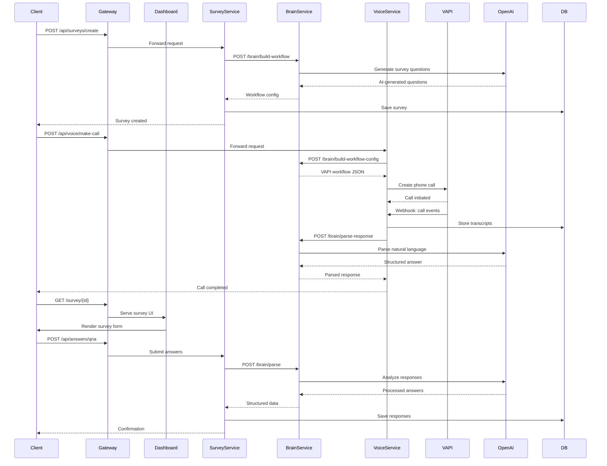
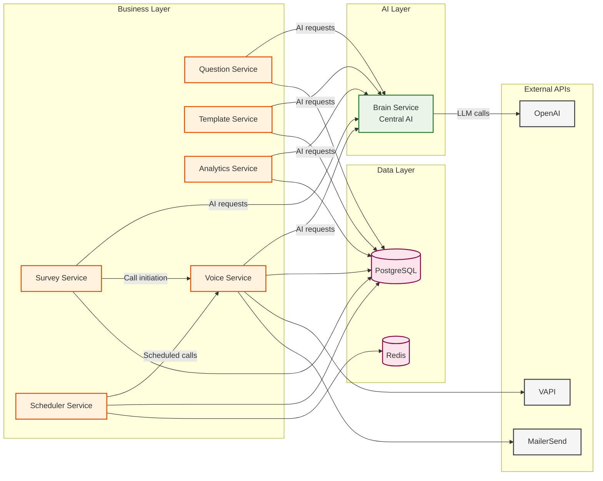

# Survey Bot Architecture Diagram

```mermaid
graph TB
    %% External Clients
    Client[Client/Browser]
    Admin[Admin User]
    SurveyUser[Survey Recipient]

    %% Gateway Layer
    Gateway[Nginx Gateway<br/>:8081]

    %% Frontend Applications
    Dashboard[Dashboard App<br/>React/Vite<br/>:8080]
    Recipient[Recipient App<br/>Next.js<br/>:3000]

    %% Infrastructure
    PostgreSQL[(PostgreSQL<br/>:5432)]
    Redis[(Redis<br/>:6379)]

    %% AI/Intelligence Services
    Brain[Brain Service<br/>:8016<br/>AI/LLM Intelligence]
    Voice[Voice Service<br/>:8017<br/>VAPI Call Management]

    %% Business Logic Services
    Survey[Survey Service<br/>:8020<br/>Survey CRUD & Answers]
    Question[Question Service<br/>:8030<br/>Question Management]
    Template[Template Service<br/>:8040<br/>Template Management]
    Analytics[Analytics Service<br/>:8060<br/>Metrics & Export]
    Scheduler[Scheduler Service<br/>:8070<br/>Job Scheduling]

    %% Legacy Service
    Agent[Agent Service<br/>:8050<br/>Legacy Compatibility]

    %% External Services
    VAPI[VAPI API]
    OpenAI[OpenAI API]
    MailerSend[MailerSend API]
    Deepgram[Deepgram API]

    %% Connections - Client to Gateway
    Client --> Gateway
    Admin --> Gateway
    SurveyUser --> Gateway

    %% Gateway Routing
    Gateway -.->|/dashboard/*| Dashboard
    Gateway -.->|/survey/*| Recipient
    Gateway -.->|/api/surveys/*| Survey
    Gateway -.->|/api/questions/*| Question
    Gateway -.->|/api/templates/*| Template
    Gateway -.->|/api/brain/*| Brain
    Gateway -.->|/api/voice/*| Voice
    Gateway -.->|/api/agent/*| Agent
    Gateway -.->|/api/analytics/*| Analytics
    Gateway -.->|/api/scheduler/*| Scheduler

    %% Service Dependencies
    Survey --> Brain
    Survey --> Voice
    Survey --> Template
    Survey --> Question
    Survey --> Scheduler
    Survey --> PostgreSQL

    Question --> Brain
    Question --> PostgreSQL

    Template --> Brain
    Template --> PostgreSQL

    Analytics --> Brain
    Analytics --> PostgreSQL

    Voice --> Brain
    Voice --> PostgreSQL
    Voice --> VAPI
    Voice --> MailerSend

    Scheduler --> Voice
    Scheduler --> Redis
    Scheduler --> PostgreSQL

    Agent --> PostgreSQL
    Agent --> VAPI
    Agent --> OpenAI

    %% Brain Service External Dependencies
    Brain --> OpenAI

    %% Frontend to Backend
    Dashboard --> Gateway
    Recipient --> Gateway
    Recipient --> Deepgram

    %% Database Connections
    PostgreSQL -.->|Primary Data Store| Survey
    PostgreSQL -.->|Primary Data Store| Question
    PostgreSQL -.->|Primary Data Store| Template
    PostgreSQL -.->|Primary Data Store| Analytics
    PostgreSQL -.->|Primary Data Store| Voice
    PostgreSQL -.->|Primary Data Store| Agent
    PostgreSQL -.->|Primary Data Store| Scheduler

    Redis -.->|Caching/Queue| Scheduler

    %% Styling
    classDef frontend fill:#e1f5fe,stroke:#01579b,stroke-width:2px
    classDef gateway fill:#f3e5f5,stroke:#4a148c,stroke-width:2px
    classDef ai fill:#e8f5e8,stroke:#2e7d32,stroke-width:2px
    classDef business fill:#fff3e0,stroke:#e65100,stroke-width:2px
    classDef infrastructure fill:#fce4ec,stroke:#880e4f,stroke-width:2px
    classDef external fill:#f5f5f5,stroke:#424242,stroke-width:2px,dashed

    class Client,Admin,SurveyUser frontend
    class Gateway gateway
    class Brain,Voice ai
    class Survey,Question,Template,Analytics,Scheduler,Agent business
    class PostgreSQL,Redis infrastructure
    class VAPI,OpenAI,MailerSend,Deepgram external
```

## Data Flow Diagram

```mermaid
sequenceDiagram
    participant Client
    participant Gateway
    participant Dashboard
    participant SurveyService
    participant BrainService
    participant VoiceService
    participant VAPI
    participant OpenAI
    participant DB

    %% Survey Creation Flow
    Client->>Gateway: POST /api/surveys/create
    Gateway->>SurveyService: Forward request
    SurveyService->>BrainService: POST /brain/build-workflow
    BrainService->>OpenAI: Generate survey questions
    OpenAI-->>BrainService: AI-generated questions
    BrainService-->>SurveyService: Workflow config
    SurveyService->>DB: Save survey
    SurveyService-->>Client: Survey created

    %% Phone Survey Flow
    Client->>Gateway: POST /api/voice/make-call
    Gateway->>VoiceService: Forward request
    VoiceService->>BrainService: POST /brain/build-workflow-config
    BrainService-->>VoiceService: VAPI workflow JSON
    VoiceService->>VAPI: Create phone call
    VAPI-->>VoiceService: Call initiated
    VAPI->>VoiceService: Webhook: call events
    VoiceService->>DB: Store transcripts
    VoiceService->>BrainService: POST /brain/parse-response
    BrainService->>OpenAI: Parse natural language
    OpenAI-->>BrainService: Structured answer
    BrainService-->>VoiceService: Parsed response
    VoiceService-->>Client: Call completed

    %% Web Survey Flow
    Client->>Gateway: GET /survey/{id}
    Gateway->>Dashboard: Serve survey UI
    Dashboard->>Client: Render survey form
    Client->>Gateway: POST /api/answers/qna
    Gateway->>SurveyService: Submit answers
    SurveyService->>BrainService: POST /brain/parse
    BrainService->>OpenAI: Analyze responses
    OpenAI-->>BrainService: Processed answers
    BrainService-->>SurveyService: Structured data
    SurveyService->>DB: Save responses
    SurveyService-->>Client: Confirmation
```

## Service Communication Pattern

```mermaid
graph LR
    subgraph "AI Layer"
        Brain[Brain Service<br/>Central AI]
    end

    subgraph "Business Layer"
        Survey[Survey Service]
        Question[Question Service] 
        Template[Template Service]
        Analytics[Analytics Service]
        Voice[Voice Service]
        Scheduler[Scheduler Service]
    end

    subgraph "Data Layer"
        DB[(PostgreSQL)]
        Cache[(Redis)]
    end

    subgraph "External APIs"
        OpenAI[OpenAI]
        VAPI[VAPI]
        Email[MailerSend]
    end

    %% AI Communication
    Survey -->|AI requests| Brain
    Question -->|AI requests| Brain
    Template -->|AI requests| Brain
    Analytics -->|AI requests| Brain
    Voice -->|AI requests| Brain

    %% Brain to External AI
    Brain -->|LLM calls| OpenAI

    %% Business Service Communication
    Survey -->|Call initiation| Voice
    Scheduler -->|Scheduled calls| Voice

    %% Database Access
    Survey --> DB
    Question --> DB
    Template --> DB
    Analytics --> DB
    Voice --> DB
    Scheduler --> DB
    Scheduler --> Cache

    %% External API Access
    Voice --> VAPI
    Voice --> Email

    classDef ai fill:#e8f5e8,stroke:#2e7d32,stroke-width:2px
    classDef business fill:#fff3e0,stroke:#e65100,stroke-width:2px
    classDef data fill:#fce4ec,stroke:#880e4f,stroke-width:2px
    classDef external fill:#f5f5f5,stroke:#424242,stroke-width:2px,dashed

    class Brain ai
    class Survey,Question,Template,Analytics,Voice,Scheduler business
    class DB,Cache data
    class OpenAI,VAPI,Email external
```
